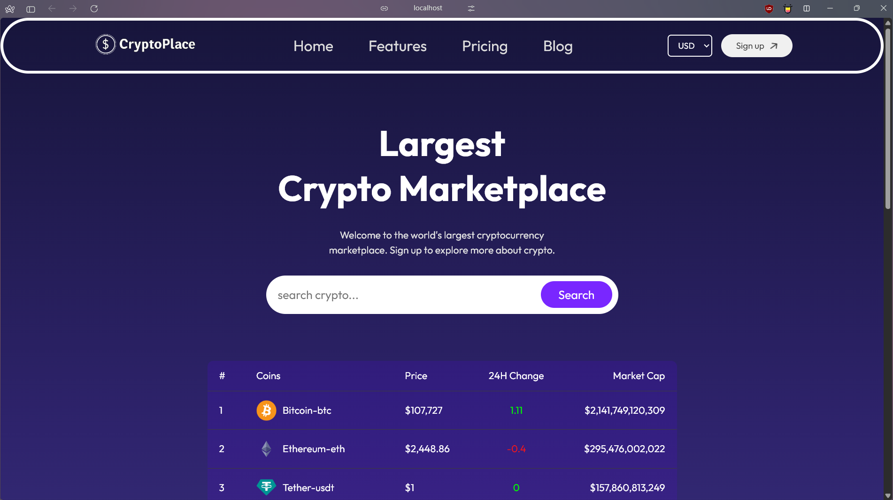
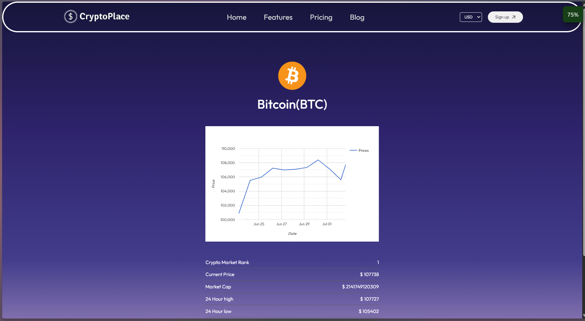

# 💰 CryptoPlace

A modern React + Vite web app that visualizes cryptocurrency data using the CoinGecko API and Google Charts.

---

## 🚀 Features

- 📊 Interactive charts with [react-google-charts](https://react-google-charts.com/)
- 🔁 Dynamic routing with `react-router-dom`
- 🔐 Environment variables support
- ⚡ Built using Vite for fast performance
- 🌐 Real-time data from [CoinGecko API](https://www.coingecko.com/en/api)

---

## 🧰 Tech Stack

- **Frontend**: React, Vite, JavaScript, HTML, CSS
- **Routing**: React Router DOM
- **Charts**: React Google Charts
- **API**: CoinGecko Public API

---

## 🛠️ Getting Started

### Step 1: Create Project

```bash
npm create vite@latest
# Select a framework: React
# Select a variant: JavaScript
```

### Step 2: Navigate and Install

```bash
cd your-project-name
npm install
npm run dev
```

### Step 3: Install Additional Packages

```bash
npm install react-router-dom
npm install react-google-charts
```

### 🔑 API Key Setup

- Visit: CoinGecko API

- Get your API key (only needed for some endpoints)

- Create a .env.local file in your project root:

```bash
VITE_COINGECKO_API_KEY=your_api_key_here
```

### 📡 API Endpoint Used

**Base URL:**

```bash
https://api.coingecko.com/api/v3/coins/
```

**Example for fetching Bitcoin data:**

```bash
https://api.coingecko.com/api/v3/coins/bitcoin
```

### 📁 Project Structure

```bash
CryptoPlace/
├── public/
│   └── vite.svg
├── src/
│   ├── assets/
│   ├── components/
│   │   ├── Footer/
│   │   ├── LineChart/
│   │   └── Navbar/
│   ├── context/
│   │   └── CoinContext.jsx
│   ├── pages/
│   │   ├── Coin/
│   │   └── Home.jsx
│   ├── App.jsx
│   ├── index.css
│   └── main.jsx
├── .env.local
├── .gitignore
├── index.html
├── LICENSE
├── package.json
├── package-lock.json
├── vite.config.js
└── README.md

```

## 📷 Screenshots

### 🏠 Home Page



---

### 💰 Coin Page



---

## 🙋‍♂️ Contact

Feel free to open an issue or reach out if you have suggestions, ideas, or want to collaborate.

---

## 👋 Final Words

Thanks for checking out **CryptoPlace**!  
Feel free to explore, contribute, or share feedback to make it even better.  
Happy coding, and may your crypto charts always go 📈🚀
